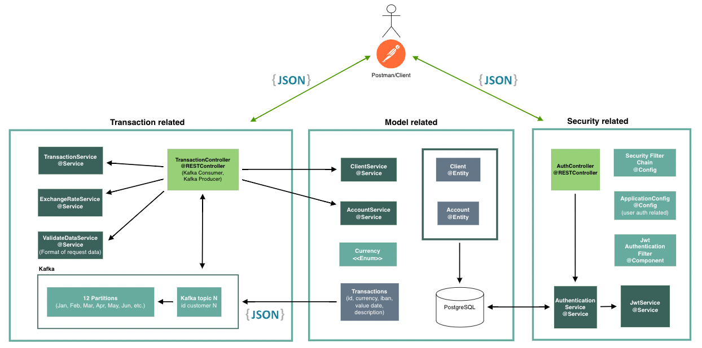
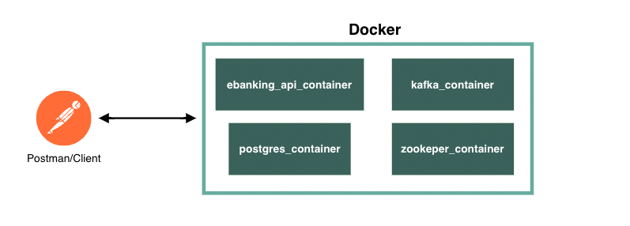

Synpulse8 - Backend Engineer Challange - ebanking-api
-
***
### About
This project is intended to be a resolution proposal for Synpulse8 Junior Java Backend vacancy in Hong Kong. The project complies with the following aspects:
- [x] Spring Boot
- [x] Spring Security with JWT authentication
- [x] PostgreSQL for saving Users and Accounts
- [x] Kafka Producer/consume for Transactions and topic management
- [x] REST Controllers (Transaction/Authentication) with open endpoints
- [x] Logging and monitoring support
- [x] JUnit
- [x] API modeling (Swagger/OpenAPI) and its documentation

To run a working copy of the code, go to [Running the project](#running-the-project)
***
### Architecture
As an overview of the architecutre, it can be seen in the picture below:



_Note: Some configuration files and components have not been included into the image to ensure readability of what is more relevant._

The application is wrapped with Docker which enables different containers:



***
### Endpoints
Enabled endpoints for user interaction:

| Endpoint                          | Description                              | Auth required?       |
|-----------------------------------|------------------------------------------|----------------------|
| `POST /api/v1/auth/register`      | Register new user                        | Does not require jwt |
| `POST /api/v1/auth/authenticate`  | Authenticate user                        | Does not require jwt |
| `POST /api/v1/transaction/publish`| Publish transactions to the system       | Requires jwt         |
| `GET /api/v1/transaction/`        | Gets paginated list of user transactions | Requires jwt         |

Once the system is up, swagger documentation is available at: `http://localhost:8080/swagger-ui/index.html#/`.

***
### Data related
- PostgreSQL: To store user and their accounts.
- Kafka: Used Kafka Topics and partitions to retrieve

Transactions are stored in kafka topics (see [Relevant implementation decisions](#Relevant-implementation-decisions) for justification).

The current solution considers creating kafka topics per year and user, following the schema: transactions-`year`-`clientName`. Each topic is divided in 12 partitions (months).
Since the data obtained does not distinguish accounts, this is the most optimal approach for fast retrieval.
***
### Security related
Security has been implemented with Spring Security and covers the following:
- Roles for clients (User, Admin)
- Encoded client password
- JWT for auth within http request
- General http security configuration (whitelisting endpoints and requiring auth for others)
- Other filters (filterchain)
***
### Pre-Requisites
To run this code it is necessary the following:
- Java v17
- Docker
***
### Running the project
1. Clone the repository:
```shell
gh repo clone alexpages/ebanking-api
```
2. Go to the root of the project and initialize containers with the code below:
```shell
docker-compose up
```
3. Containers should start (Kafka, Zookeper, Postgresql and ebanking-api) and the application is ready for interaction.


Docker-compose.yml has a structure based on different services/containers. 
The Spring Boot application is wrapped into a docker image which is created in the moment of performing the second step. 

In the file it is defined a context (directory) and the file to run (Dockerfile) to create the Docker image.
Dependencies between containers and _restart_ patterns will ensure the correct deployment of the whole app.
***
### Examples of requests

`POST /api/v1/auth/register`
```
{
  "clientName": "synpulse8",
  "password": "password",
  "accounts": [
    {
      "iban": "CH93-0000-0000-0000-0000-0",
      "currency": "EUR"
    },
    {
      "iban": "EH93-0000-0000-0000-0000-0",
      "currency": "EUR"
    }
  ]
}
```
`POST /api/v1/auth/authenticate`
```
{
"clientName": "synpulse8",
"password": "password",
}
```
`POST /api/v1/transaction/publish`
```
{
  "id" : "synpulse8",
  "currency": "EUR",
  "amount": "350",
  "iban" : "CH93-0000-0000-0000-0000-0",
  "date" : "03-01-2019",
  "description" : "Online payment EUR"
}
```
```
"amount": "-350",
```

`GET /api/v1/transaction/`
```
{
  "clientName" : "synpulse8",
  "year" : "2019",
  "month" : "01",
  "pageSize" : "4"
}
```

***
### Relevant implementation decisions
- **N-Tier architecture**/Folder architecture - by element function within the project.
- **Store transactions in Kafka topics** and not in DB.
  - Avoid using Pageable - Transactions are not saved into a Repository.
  - Avoid using Kafka Streams - Wrong approach, it is for Real-Time Data Ingestion.
- **Kafka Topic/Partition** distribution
  - Consideration 1: Grouping transactions by IBAN.
  - Consideration 2: Grouping transactions by KTable to perform interactive queries (Applicable for overall money balance)
  - Final decision: more topics (year-user combination) and partitions (12 per topic, as in months) was decided.
- **Dockerfile** to create spring boot app
- **Docker-compose** set with images compatible linux/arm64
- Made **REST API reusable** by using environmental variables within docker-compose and application.yml, always with default values.
***
### Future improvements
- [x] Implement Custom SERDES for Kafka Streams
- [ ] Improve Exchange Rate Service to customize base currency
- [ ] Kafka Streams and Topology for filtering transactions
- [ ] Kafka Tables for updating the total balance of each user (Key-Value Store) with interactive queries
- [ ] Microservice for JWT generation and renewal
****

