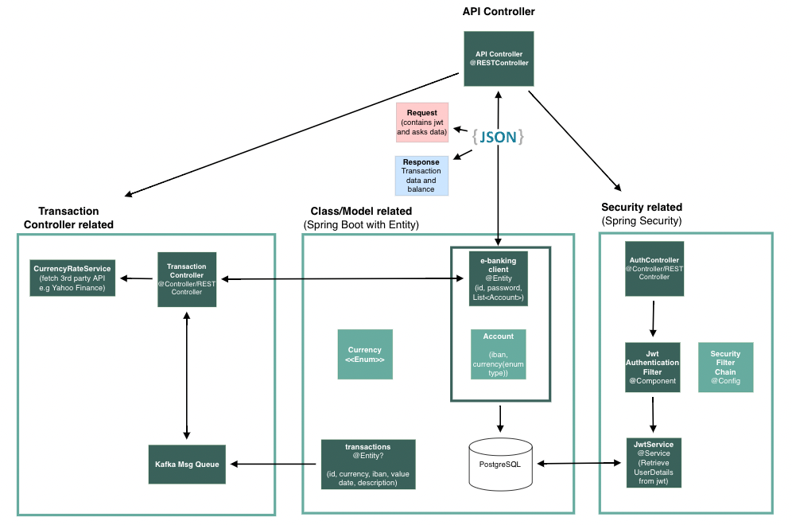

Synpulse8 HK - Backend challange - ebanking-api
-
***
### About
This project is intended to be a resolution proposal for Synpulse8 Junior Java Backend vacancy in Hong Kong. The project complies with the following aspects:
- [x] Spring Boot
- [x] Spring Security 
- [x] JWT authentication
- [x] PostgreSQL for Users and Accounts
- [x] Kafka Producer/consumer, topic management
- [x] REST Controller with open endpoints
- [ ] JUnit
- [ ] Logging and monitoring support

***
### Pre-Requisites
- Java v17
- Docker

***
### Architecture

The suggested architecture is the following:

***
### Database
- PostgreSQL: to store user, accounts and tokens (jwt)
- Kafka: To retrieve data from messaging queues and in-memory storage. To set up locally follow: https://kafka.apache.org/quickstart
***
### Security
Security has been implemented with the following concepts:

- Roles
- Encoded client password
- JWT for Auth within http request
- General http security configuration
- Other filters (filterchain)

***
### Future improvements

- [x] Implement Custom Serdes for Kafka Streams
- [ ] Kafka Streams for filtering
- [ ] Kafka Tables for updating the balance of each user (Key-Value Store)
- [ ] Microservice for JWT generation

****

