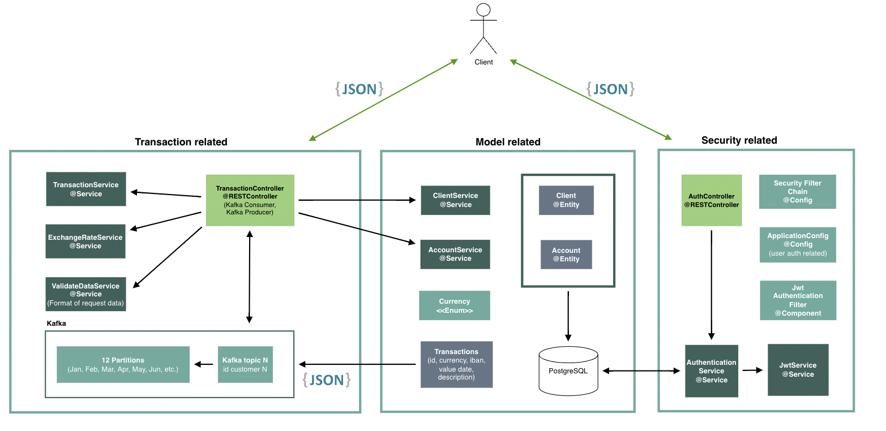

Synpulse8 HK - Backend challange - ebanking-api
-
***
### About
This project is intended to be a resolution proposal for Synpulse8 Junior Java Backend vacancy in Hong Kong. The project complies with the following aspects:
- [x] Spring Boot
- [x] Spring Security 
- [x] JWT authentication
- [x] PostgreSQL for Users and Accounts
- [x] Kafka Producer/consumer, topic management
- [x] REST Controller with open endpoints
- [x] Logging and monitoring support
- [x] JUnit


To run a working copy of the code, go to [Running the project](#running-the-project)
***
### Pre-Requisites
To run this code it is necessary the following:
- Java v17
- Docker

***
### Architecture

As an overview of the architecutre, it can be seen in the picture below:



_Note: Some configuration files and components have not been included to ensure readability of what is more relevant._
***
### Data related
- PostgreSQL: to store user, accounts and tokens (jwt)
- Kafka: Used Kafka Topics and partitions to retrieve
***
### Security
Security has been implemented with Spring Security and covers the following:
- Roles
- Encoded client password
- JWT for Auth within http request
- General http security configuration
- Other filters (filterchain)

***
### Relevant implementation decisions
- N-Tier architecture/Folder architecture - by element function within the project.
- Store transactions in Kafka topics and not in DB.
  - Avoid using Pageable - Transactions are not saved into a Repository.
  - Avoid using Kafka Streams - Wrong approach, it is for Real-Time Data Ingestion.
- Kafka Topic/Partition distribution
  - Consideration 1: Grouping transactions by IBAN.
  - Consideration 2: Grouping transactions by KTable to perform interactive queries (Applicable for overall money balance)
  - Final decision: more topics (year-user combination) and partitions (12 per topic, as in months) was decided.
- Multi-stage Dockerfile
- Docker-compose set with images compatible linux/arm64 
***
### Running the project
Since the application is wrapped inside a docker container. Just perform docker-compose up operation on the shell [docker-compose.yml](docker-compose.yml). 
It will start a Zookeeper instance, the Kafka broker, PostgreSQL for client related and the Spring Boot app.
```shell
docker compose -f ./docker-compose.yml up
```
### Building and starting the application
```shell
tbd
```

***
### Future improvements
- [x] Implement Custom Serdes for Kafka Streams
- [ ] Improve Exchange Rate Service to customize base currency
- [ ] Kafka Streams and Topology for filtering transactions
- [ ] Kafka Tables for updating the total balance of each user (Key-Value Store) with interactive queries
- [ ] Microservice for JWT generation and renewal

****

